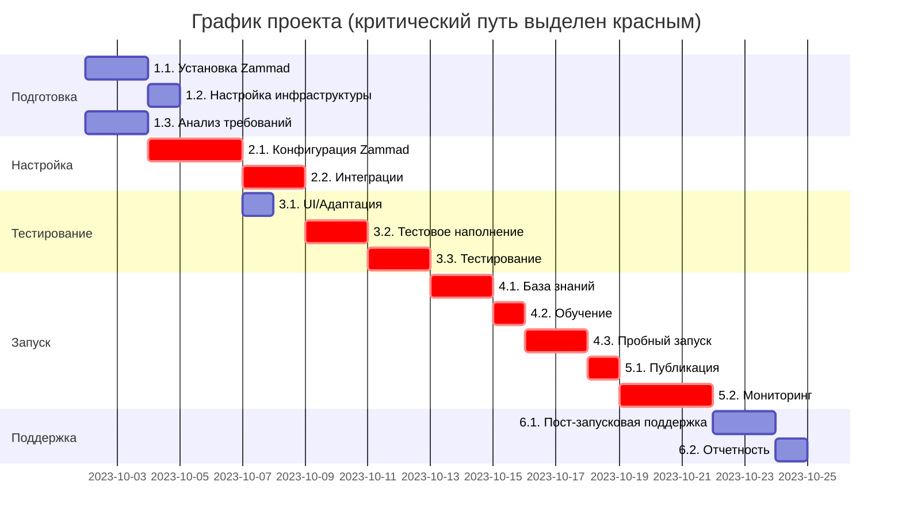
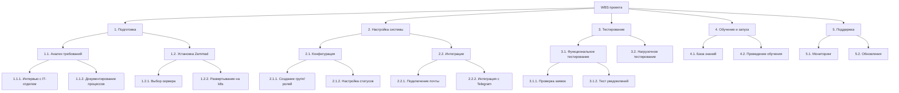
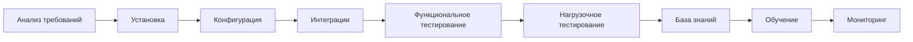
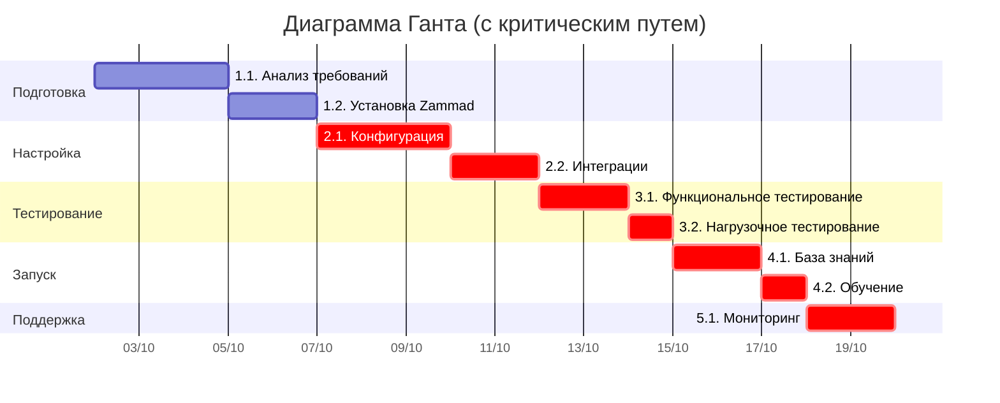
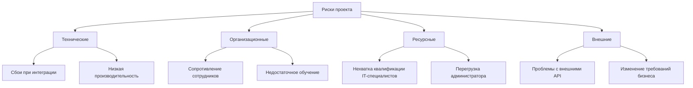

## Управление проектами
## 1
#### Определения
Проект - совокупность действий направленных на конечный результат, истиным смыслом проведения которых явлется фиксированный результат
Управление проектом - некие рамки, которые устанавливаются и используются в качестве направляющей, для регулировки проекта. С помощью данных рамок проект должен постараться сохранить все те старотовые переменные, которые были в него залдожены.

---

организация вечеринки; ДА
внедрение новой процедуры подбора персонала компании; ДА
уборка квартиры; НЕТ
замена информационной системы по учету труда и заработной платы компании; ДА
покраска крупного моста; ДА
возведение монумента на площади; повторяющиеся (рутинные) операции предприятия; НЕТ
организация олимпиады в Сочи в 2014 г., постройка офисного здания; ДА
апгрейд планшета производителем; ДА
разработка и вывод на рынок инновационного продукта; ДА
замена аппаратного (ПК) и программного обеспечения учебной аудитории ВУЗа; ДА
составление ежегодных финансовых отчѐтов предприятия; НЕТ
осуществление изменений в оргструктуре и кадровом составе организации; ДА
строительство Титаника; ДА

---
## 2

В компании, в которой я работаю существует проблема с управлением заявками от пользователей для IT отдела. Необходимо реализовать решение этой проблемы.
КОНЦЕПЦИЯ (МОДЕЛЬ) ПРОЕКТА «ВНЕДРЕНИЕ СИСТЕМЫ УПРАВЛЕНИЯ IT-ЗАЯВКАМИ»
1. Проект направлен на разработку и внедрение автоматизированной системы управления заявками пользователей в IT-отделе компании. Решение позволит упорядочить процесс обработки запросов, повысить прозрачность и скорость выполнения задач, а также снизить нагрузку на сотрудников.
2. Хаос в решении задач, скорость обработки, степень важности заявок, обратная связь, отсутвие аналитики.
3. Упорядочить процесс подачи и обработки заявок - внедрение системы HelpDesk - Zammad. Повысить прозрачность и скорость обработки запросов - подключение внешних источников данных в систему Zammad. Снижение нагрузки на отдел IT - система документации в Zammad.
4. Анализ и проектирование (1 недели), настройка и базовое тестирование (2 недели), внедрение и обучение (3 недели, сквозным графиком), Поддрежка (до конца жизни проекта)
5. Сопротивление сотрудников - средняя ,Перегрузка IT-отдела в период внедрения - высокая, Недостаточная функциональность выбранной системы - низкая
6. Дохода прямого от проекта нет, но косвенный доход будет состоять из времени сотрудников на решение проблем(около 50%), уменьшение затрат на повтороное решение проблем (около 20%). Данные для расчета выйдут следующие: затраты на реализацию - 30 дней (по рабочим дням на решение) * 8 часов (время рабочего дня) * 1000 рублей(стоимость часа DevOps) = 240.000  рублей. Время окупа затрат - 240.000 (затраты на реализацию)/ 500 рублей (стоимость часа технической поддержки) = 480 часов = 60 дней = 2 месяца.

---

## 3
#### **1. Подготовительный этап (анализ и ТЗ)**  
- Провести аудит текущего процесса обработки заявок.  
- Определить ключевые требования к системе:  
  - Типы заявок (инциденты, запросы на обслуживание, вопросы).  
  - Роли пользователей (сотрудники, IT-специалисты, администраторы).  
  - Необходимые интеграции (почта, мессенджеры, Active Directory).  
- Составить ТЗ с описанием:  
  - Настроек групп, статусов и workflow в Zammad.  
  - Необходимых доработок (если нужна кастомизация).  
- Согласовать с заказчиком.  

#### **2. Разработка дизайн-макета (адаптация интерфейса)**  
- Настроить фирменный стиль в Zammad (логотип, цвета).  
- Оптимизировать интерфейс под нужды компании:  
  - Создать кастомные формы для заявок.  
  - Настроить шаблоны ответов.  
- Протестировать UX с группой сотрудников.  

#### **3. Верстка (если требуется кастомизация фронтенда)**  
- При необходимости доработать стили для изменения внешнего вида.   
- Проверить корректность отображения во всех браузерах.  

#### **4. Программирование (настройка и интеграции)**  
- Развернуть Zammad на сервере компании (или облачном хостинге).  
- Настроить:  
  - Пользователей и группы доступа.  
  - Автоматические триггеры и макросы.  
  - Интеграцию с почтой (IMAP/POP3), Telegram.  
  - Синхронизацию с SSO.  
- При необходимости разработать кастомные плагины.  

#### **5. Наполнение контентом**  
- Заполнить базу знаний (Knowledge Base):   
  - Частые вопросы (FAQ).  
  - Гайды для IT-сотрудников.  
- Создать шаблоны ответов для типовых запросов.  
- Подготовить тестовые заявки для обучения.  

#### **6. Размещение в сети**  
- Настроить доменное имя (например, `zammad.domain.ui`).  
- Установить SSL-сертификат через обратный прокси.
- Настроить резервное копирование в S3 хранилище.

#### **7. Тестирование**  
- Проверить все сценарии работы:  
  - Создание заявок через разные каналы (почта, веб, Telegram).  
  - Назначение и эскалация заявок.  
  - Автоматические уведомления.  
  - Отчеты и статистика.  
- Исправить выявленные ошибки.  

#### **8. Раскрутка (внедрение в компании)**  
- Провести обучение для:  
  - Сотрудников (как создавать заявки).  
  - IT-отдела (как работать с системой).  
- Разослать анонсы по email и корпоративным чатам.  
- Разместить инструкции в доступных местах.  

#### **9. Администрирование и поддержка**  
- Назначить ответственных за администрирование Zammad.  
- Регулярно:  
  - Обновлять систему.  
  - Пополнять базу знаний.  
  - Анализировать статистику (время решения заявок, нагрузка).  
- Настроить мониторинг работоспособности.
---
## 4

#### **Критический путь**:  

`Развертывание → Настройка → Интеграции → Тестирование → Обучение → Запуск`  

---

### **Неделя 1: Подготовка и развертывание**  
| **Этап**                     | **Задачи**                                                                 | **Длительность** | **Зависимости**       |
|-----------------------------|--------------------------------------------------------------------------|----------------|---------------------|
| **1.1. Установка Zammad**   | - Установка k8s через heml <br> - Базовая конфигурация | 2 дня          | -                   |
| **1.2. Настройка инфраструктуры** | - Регистрация домена <br> - Настройка SSL <br> - Резервное копирование | 1 день         | Завершение 1.1      |
| **1.3. Анализ требований**  | - Определение workflow заявок   | 2 дня          | -                   |

### **Неделя 2: Настройка системы**  
| **Этап**                     | **Задачи**                                                                 | **Длительность** | **Зависимости**       |
|-----------------------------|--------------------------------------------------------------------------|----------------|---------------------|
| **2.1. Конфигурация Zammad** | - Создание групп (IT, Users, Admins) <br> - Настройка статусов заявок <br> - Шаблоны ответов | 3 дня          | Завершение 1.1, 1.3 |
| **2.2. Интеграции**         | - Подключение корпоративной почты <br> - Интеграция с Telegram | 2 дня          | Завершение 2.1      |

### **Неделя 3: Кастомизация и тестирование**  
| **Этап**                     | **Задачи**                                                                 | **Длительность** | **Зависимости**       |
|-----------------------------|--------------------------------------------------------------------------|----------------|---------------------|
| **3.1. UI/Адаптация**      | - Изменение цветов/логотипа <br> - Настройка мобильного отображения      | 1 день         | Завершение 2.1      |
| **3.2. Тестовое наполнение** | - Создание тестовых заявок <br> - Проверка триггеров и макросов          | 2 дня          | Завершение 2.1, 2.2 |
| **3.3. Тестирование**      | - Проверка всех сценариев работы <br> - Исправление багов                | 2 дня          | Завершение 3.1, 3.2 |

### **Неделя 4: Обучение и подготовка к запуску**  
| **Этап**                     | **Задачи**                                                                 | **Длительность** | **Зависимости**       |
|-----------------------------|--------------------------------------------------------------------------|----------------|---------------------|
| **4.1. База знаний**       | - Создание FAQ для пользователей            | 2 дня          | Завершение 3.3      |
| **4.2. Обучение**          | - Вебинар для сотрудников          | 1 день         | Завершение 4.1      |
| **4.3. Пробный запуск**    | - Ограниченный доступ для тестовой группы <br> - Сбор обратной связи     | 2 дня          | Завершение 4.2      |

### **Неделя 5: Полномасштабный запуск**  
| **Этап**                     | **Задачи**                                                                 | **Длительность** | **Зависимости**       |
|-----------------------------|--------------------------------------------------------------------------|----------------|---------------------|
| **5.1. Публикация**        | - Открытие доступа для всех сотрудников <br> - Рассылка анонсов          | 1 день         | Завершение 4.3      |
| **5.2. Мониторинг**        | - Анализ первых заявок <br> - Корректировка настроек (при необходимости) | 3 дня          | Завершение 5.1      |

### **Неделя 6: Поддержка и оптимизация**  
| **Этап**                     | **Задачи**                                                                 | **Длительность** | **Зависимости**       |
|-----------------------------|--------------------------------------------------------------------------|----------------|---------------------|
| **6.1. Пост-запусковая поддержка** | - Разбор сложных кейсов <br> - Доработка триггеров/макросов       | 2 дня          | Завершение 5.2      |
| **6.2. Отчетность**        | - Формирование отчетов по эффективности <br> - План дальнейших улучшений | 1 день         | Завершение 6.1      |


### **Визуализация критического пути**  


## 5
---

### **1. Заинтересованные стороны:**  
- **IT-отдел** – высокое влияние и заинтересованность (используют систему ежедневно).  
- **Руководство** – высокое влияние, но средняя заинтересованность (контроль бюджета и эффективности).  
- **Сотрудники** – низкое влияние, но высокая заинтересованность (зависимость от скорости решения заявок).  
- **Администраторы** – среднее влияние и заинтересованность (поддержка работоспособности).  

---

### **2. Матрица ответственности RACI**  
| **Этап/Роль**               | **Руководство** | **IT-отдел** | **Администраторы** | **Сотрудники** |  
|----------------------------|---------------|-------------|------------------|--------------|  
| **1. Установка Zammad**    | I             | R           | A                | C            |   
| **2. Настройка workflow**  | C             | R           | A                | I            |   
| **3. Интеграции**          | I             | A           | R                | I            |  
| **4. Тестирование**        | I             | R           | A                | C            |   
| **5. Обучение пользователей** | A          | R           | С                | C            |
| **6. Запуск и мониторинг** | R             | A           | С                | C            |  
| **7. Поддержка**           | I             | A           | R                | C            |  

#### **Условные обозначения:**  
- **R (Responsible)** – ответственный за выполнение.  
- **A (Accountable)** – утверждающий (несет конечную ответственность).  
- **C (Consulted)** – консультант (предоставляет информацию).  
- **I (Informed)** – информируемый (получает отчеты).   

---
## 6

### **1. Детализированная иерархическая структура работ**  



### **2. Сетевой график и критический путь**  
#### **Диаграмма предшествования**  


#### **Оптимизация графика**  
- Параллельные задачи:  
  - Настройка UI (2.1.3) и интеграций (2.2) могут выполняться одновременно.  
- Сокращение времени:  
  - Автоматизация развертывания → экономия 1 дня.  

---

### **3. Диаграмма Ганта**  


**Условные обозначения:**  
- Красные задачи (`crit`) – критический путь.  
- Серые – задачи с резервом времени.  
- **Вехи**:  
  - Завершение установки (05/10).  
  - Готовность к запуску (16/10).  

---

### **4. График привлечения ресурсов**  
| **Ресурс**          | **Неделя 1** | **Неделя 2** | **Неделя 3** | **Неделя 4** |  
|---------------------|-------------|-------------|-------------|-------------|  
| **IT-аналитик**     | 100%        | 50%         | -           | -           |  
| **Системный администратор** | 50%  | 100%        | 50%         | 25%         |  
| **Тестировщик**     | -           | 50%         | 100%        | -           |  

#### **Оптимизация ресурсов:**  
- Перераспределение нагрузки администратора на 2 неделе (интеграции + тестирование).

---
## 7

#### **1. Иерархическая структура рисков**  


---

#### **2. Список идентифицированных рисков**  
| **Риск**                          | **Дата наступления** | **Категория**      |
|-----------------------------------|---------------------|-------------------|
| Сбои при интеграции с почтой      | Неделя 2            | Технический       |
| Сопротивление сотрудников         | Неделя 4            | Организационный   |
| Нехватка квалификации IT-специалистов          | Неделя 1-3          | Ресурсный         |
| Проблемы с API Telegram     | Неделя 2-3          | Внешний           |
| Низкая производительность сервера | Неделя 3            | Технический       |

---

#### **3. Матрица вероятности и влияния**  
```mermaid
quadrantChart
    title Матрица оценки рисков
    x-axis Вероятность --> "Низкая", "Средняя", "Высокая"
    y-axis Влияние --> "Минимальное", "Умеренное", "Критическое"
    
    quadrant-1 Снизить приоритет
    quadrant-2 Контролировать
    quadrant-3 Мониторить
    quadrant-4 Критические
    
    "Сбои интеграции": [0.7, 0.8]
    "Сопротивление": [0.6, 0.7]
    "Нехватка специалистов": [0.5, 0.9]
    "Проблемы с API": [0.3, 0.6]
    "Производительность": [0.4, 0.8]
```

**Ранжирование:**  
1. Нехватка IT-специалистов (высокое влияние)  
2. Сбои при интеграции  
3. Сопротивление сотрудников  

---

#### **4. Количественный анализ**  
| **Риск**                  | **Вероятность** | **Влияние (1-10)** | **Приоритет** |
|--------------------------|----------------|-------------------|--------------|
| Нехватка квалификации специалистов    | 50%            | 9                 | Высокий      |
| Сбои интеграции          | 70%            | 8                 | Высокий      |
| Низкая производительность| 40%            | 8                 | Средний      |

---

#### **5. Упреждающие мероприятия**  
| **Риск**                  | **Мероприятие**                                                                 | **Срок**       |
|--------------------------|-------------------------------------------------------------------------------|---------------|
| Сбои интеграции          | Тестовое подключение API до внедрения                                         | Неделя 1       |
| Сопротивление            | Проведение пилотного внедрения для ключевых пользователей                     | Неделя 3       |
| Нехватка квалификации специалистов    | Повышения квалификации путем обучения                                             | Неделя 1       |

---

#### **6. Мероприятия при наступлении**  
| **Риск**                  | **Действие**                                                                  | **Ответственный** |
|--------------------------|-----------------------------------------------------------------------------|-----------------|
| Проблемы с API           | Переход на резервный канал связи (например, email вместо Slack)             | Администратор   |
| Низкая производительность| Оптимизация сервера или масштабирование ресурсов                            | DevOps-инженер  |

---

#### **7. Реестр рисков (Таблица 1)**  
| **№** | **Риск**                  | **Категория** | **Вероятность** | **Влияние** | **Статус** | **Ответственный** | **Мероприятия**                              |
|------|--------------------------|--------------|----------------|------------|------------|------------------|--------------------------------------------|
| 1    | Сбои интеграции          | Технический  | Высокая        | Критическое| Активен    | IT-администратор | Тестовое подключение API                   |
| 2    | Сопротивление сотрудников| Организационный | Средняя     | Высокое    | Мониторинг | HR-менеджер      | Пилотное внедрение                         |
| 3    | Нехватка квалификации специалистов    | Ресурсный    | Средняя        | Критическое| Активен    | Руководитель проекта | Повышения квалификации путем обучения                    |
| 4    | Проблемы с внешними API  | Внешний      | Низкая         | Среднее    | Закрыт     | Разработчик       | Резервный канал связи                     |

---
